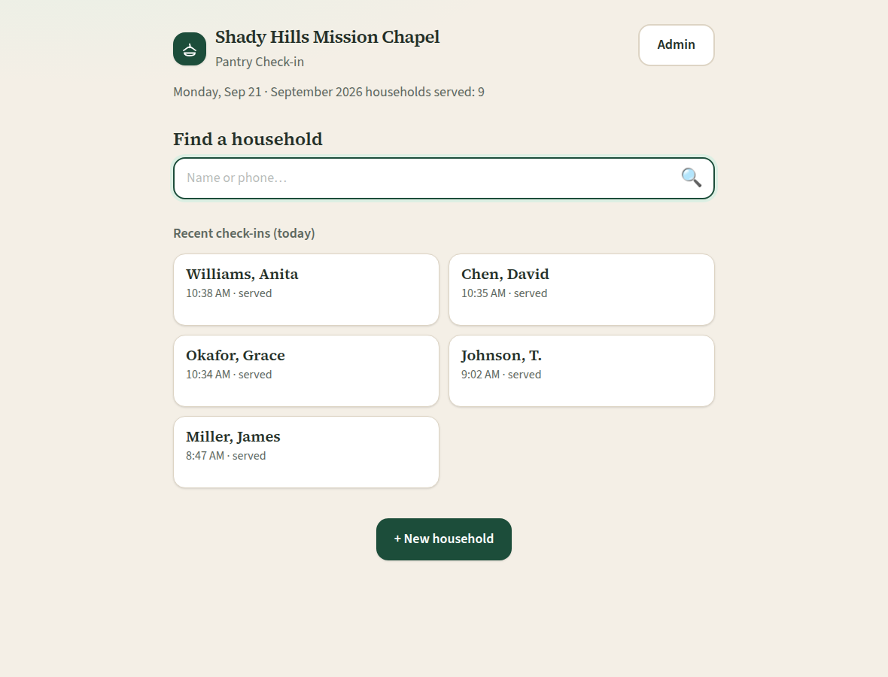
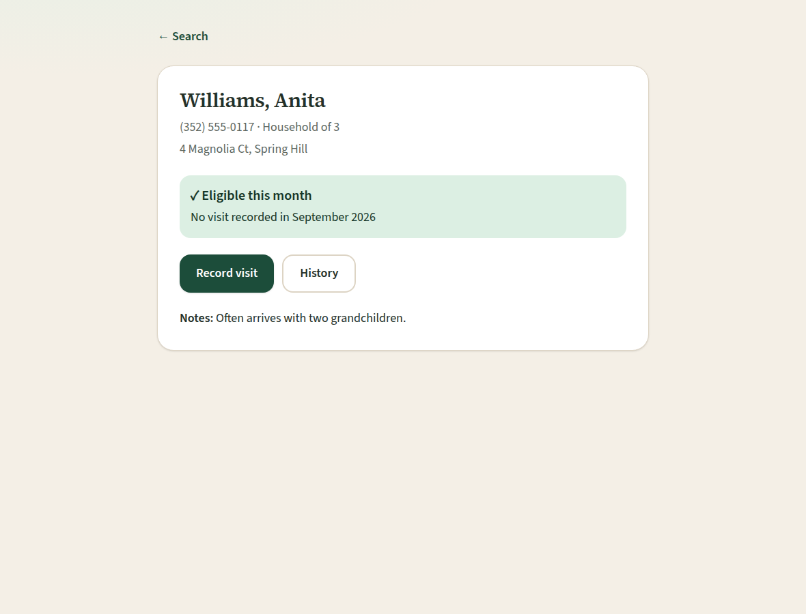
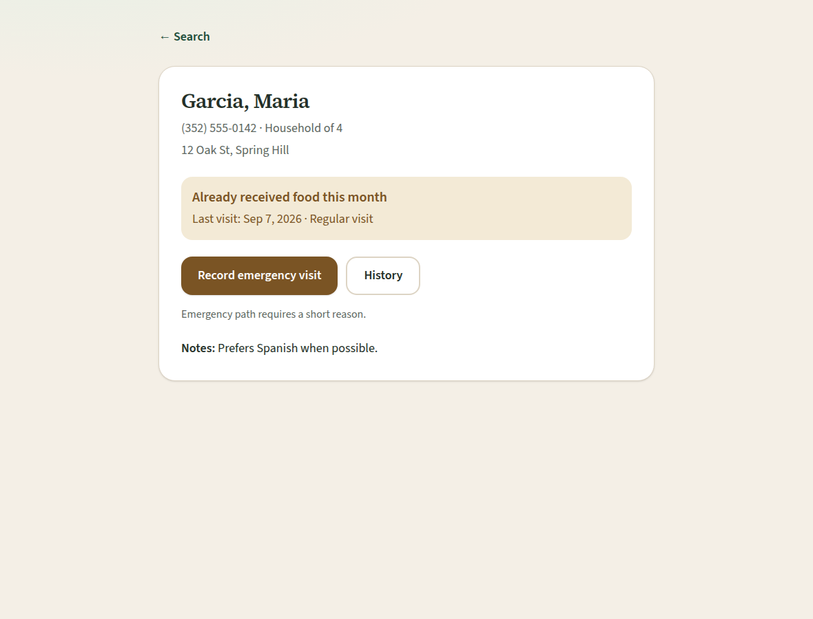
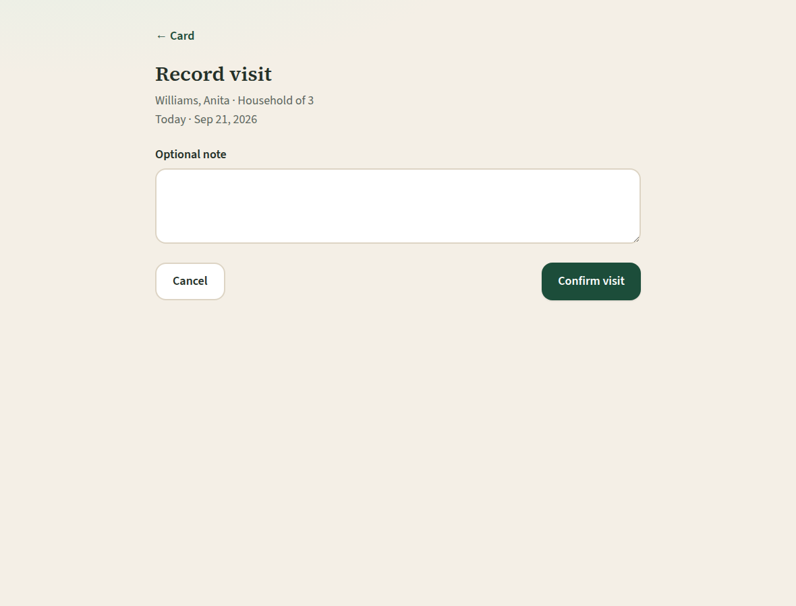
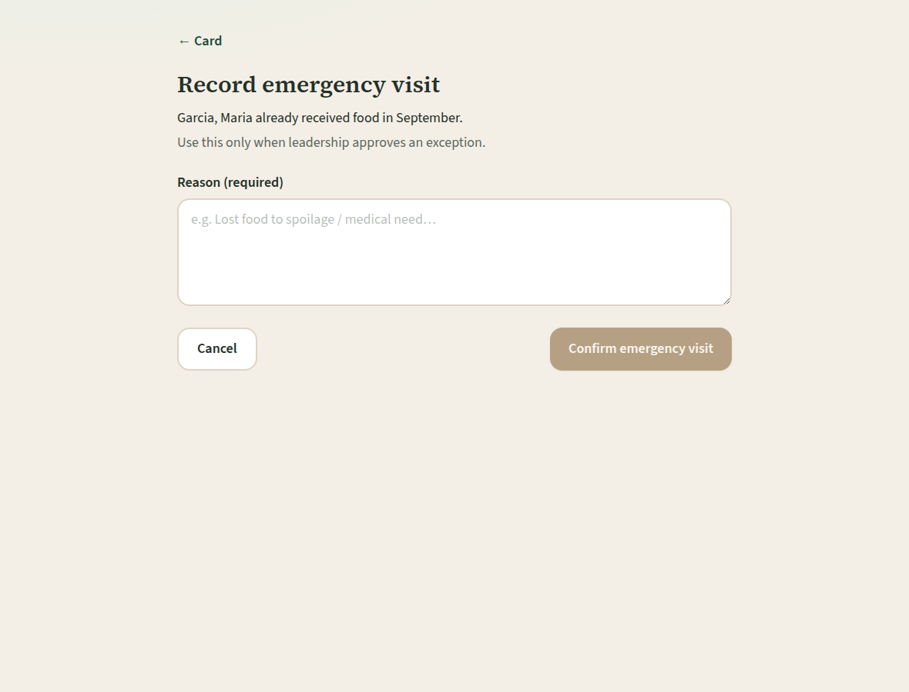
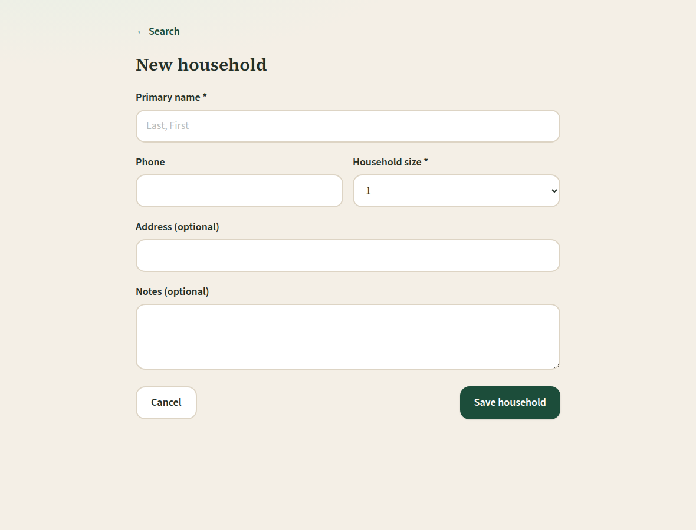
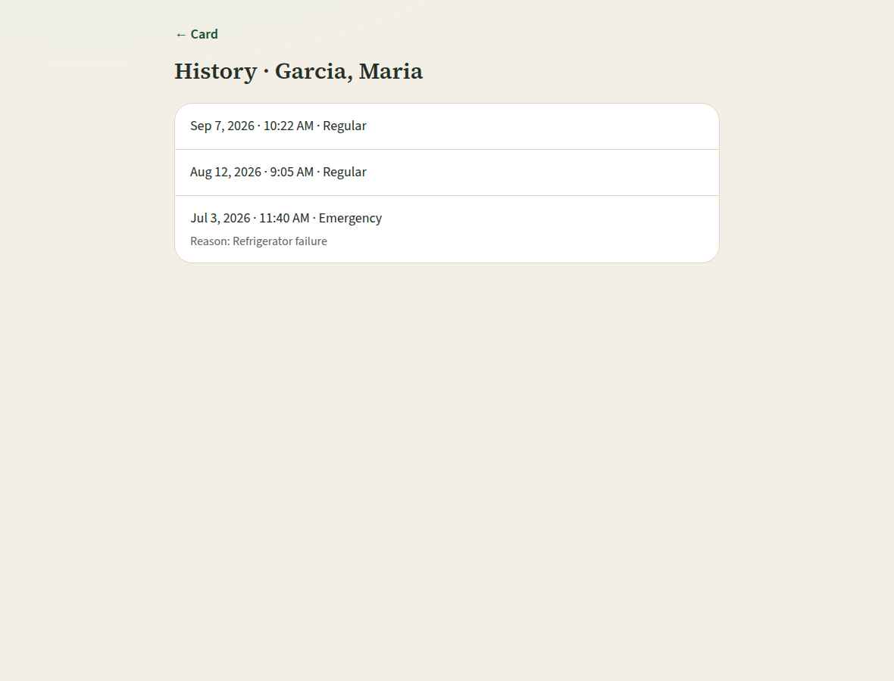
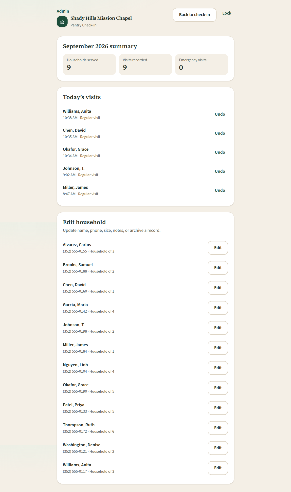

# Shady Hills Mission Chapel — Pantry Check-in

**App:** [https://freddyja.github.io/christian-food-pantry-intake/](https://freddyja.github.io/christian-food-pantry-intake/)

Tablet-friendly intake PWA for **Shady Hills Mission Chapel** pantry volunteers. Find a household, see whether they can receive food **this calendar month**, record a visit, register a new household, or use a short emergency exception. Install it on the pantry iPad from that github.io link (Add to Home Screen). Data stays on the device in IndexedDB.

Language stays warm and dignified. The app says **“Already received food this month,”** never denied, blocked, or ineligible.

## Policy

- **One visit per household per calendar month** (calendar month, not a rolling 30 days).
- Timezone for “this month,” “today,” and timestamps: **America/New_York**.
- **Emergency override** is allowed when leadership approves an exception. A reason of at least 3 characters is required. The visit is still recorded as served, with `is_emergency=true`.
- Eligibility is household-level, not person-level.

## Use the app (iPad / tablet)

1. Open **[https://freddyja.github.io/christian-food-pantry-intake/](https://freddyja.github.io/christian-food-pantry-intake/)**.
2. **Install:**
   - **iPad / iPhone:** Share → **Add to Home Screen**
   - **Android / Chrome:** menu → **Install app** / Add to Home screen
3. After install it opens as its own app (standalone) and works offline. Households and visits are stored in **this device’s IndexedDB** (`shady-hills-pantry`). There is no multi-tablet sync — use Admin → Export JSON backup before switching devices.

## Demo walkthrough

Sample data is seeded automatically on first open (12 households). Some already received food this month; others are eligible.

1. Open the home **Search** screen. Try `Garcia` or `3525550142`.
2. Open **Garcia, Maria** — banner should read **Already received food this month**. Use **Record emergency visit** and enter a reason (Confirm stays disabled until 3+ characters).
3. Search **Williams** or **Okafor** — **Eligible this month**. **Record visit** is one confirm (optional note), then “Visit recorded. Thank you for serving.”
4. **+ New household** saves and lands on that household’s card so you can record today’s visit immediately.
5. **History** on a card shows prior months, including emergency reasons.
6. **Admin** (PIN **`1234`**) — month summary, today’s visits with **Undo**, household edit, and JSON export/import.

## Run locally

Requires **Node.js 22+**.

```bash
npm install
npm test
npm run dev
```

Open [http://localhost:5173](http://localhost:5173). Nothing is stored on a server; IndexedDB is created in your browser and seeded on first run.

```bash
npm run build
npm run preview
```

Preview uses the GitHub Pages base path: [http://localhost:4173/christian-food-pantry-intake/](http://localhost:4173/christian-food-pantry-intake/).

## GitHub Pages

The lasting app link is:

**https://freddyja.github.io/christian-food-pantry-intake/**

Same pattern as [biblical-pharmacy](https://freddyja.github.io/biblical-pharmacy/): GitHub Pages serves **`index.html` at the `main` branch root**, with `.nojekyll`. The production base path is `/christian-food-pantry-intake/`. `npm run build` writes the static PWA (hashed assets, service worker, manifest) onto that root.

## Screenshots

















## Screens

| Screen | Route |
| --- | --- |
| Search (home) | `#/` |
| Household card | `#/households/:id` |
| Record visit | `#/households/:id/visit` |
| Emergency visit | `#/households/:id/emergency` |
| New household | `#/households/new` |
| History | `#/households/:id/history` |
| Admin | `#/admin` (PIN gate at `#/admin/login`) |

## Data model

**Household** — id, primary name, phone, address, household size, notes, timestamps, active.

**Visit** — household, visited_at, served, is_emergency, emergency_reason, optional note, recorded_by, undone_at.

A household is eligible when there is no non-undone visit in the current calendar month (America/New_York). Records live in IndexedDB on the device that opened the app. Admin can export or import a JSON backup.

## Non-goals (v1)

No client self-check-in, inventory, ID scanning, SMS, or multi-site support.
